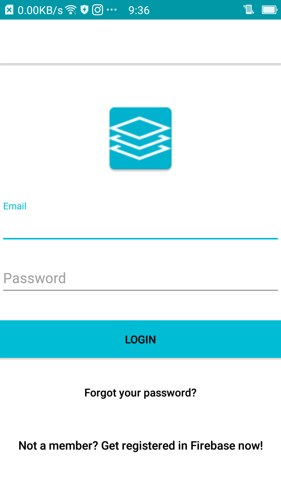
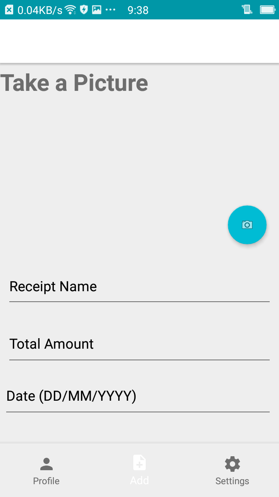

This project was based on an android application where saving and keeping track receipts can be made easier just by simply taking a picture of the receipt and saving it onto the database this can be useful to anyone who wishes to keep track of their receipts. The technology behind the solution uses Firebase to store and pull data, also the app uses most of the android UI/UX design principles making it look like any other android application and with this I learnt about the android life cycle and gradle and some of the android designs. Some of the screenshots have been added below. 

  
  
  

