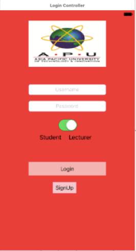

This project was given by the university as an assignment where I had to build an IOS application for students to book a consultation with their lecturers through this mobile application making it more portable as the current system doesn’t allow this feature. The technology behind this solution uses the basic Swift concepts.  

  

