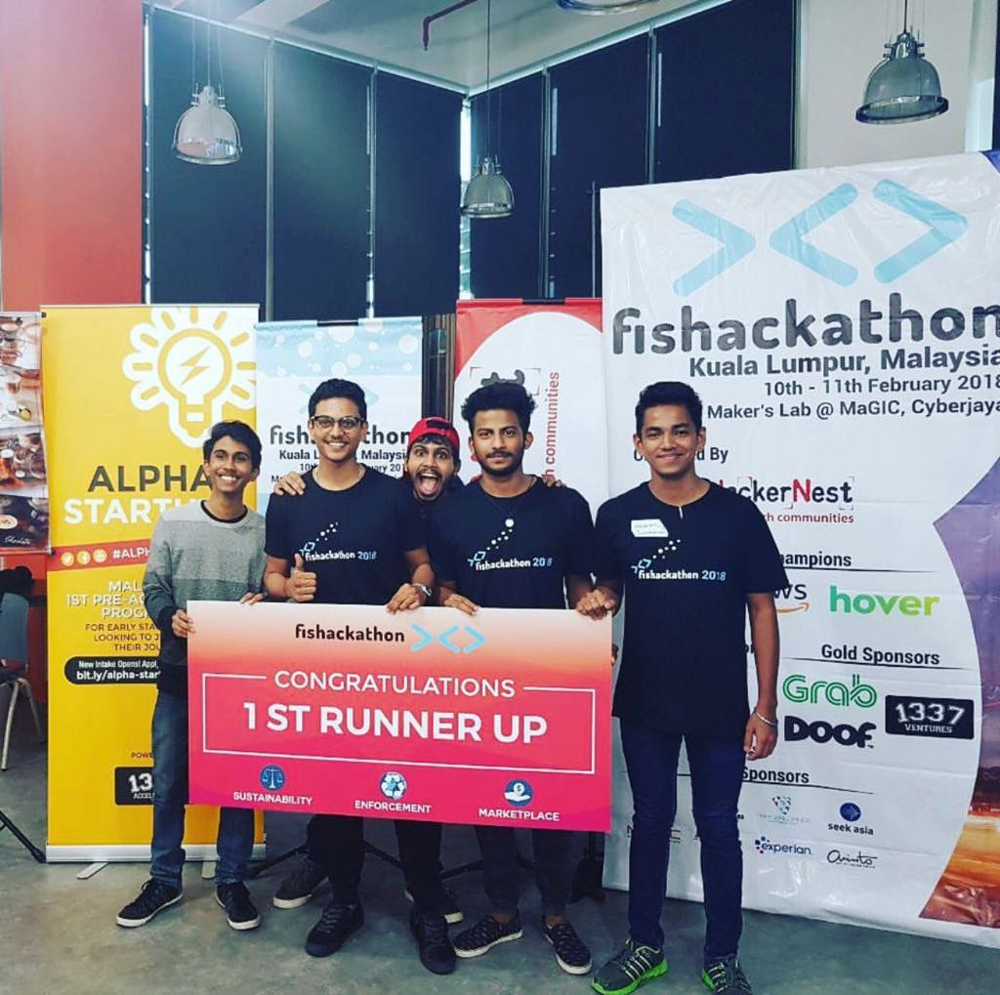

  

Fishackathon called up on developers of all skill levels to build and pitch a technological solution to sustainable fisheries. My team built a web application that records and tracks fish as assets on the blockchain using camera input. The technology behind the solution uses a TensorFlow model to do image recognition and IBM Hyperledger blockchain. We placed 2nd in this competition. It was a prestigious moment to address problems brought up by organizations such as the WWF and the US Department of State. 

  

Source: <a href="https://github.com/jogarces/ics-313-text-game"><i class="large github icon "></i>jogarces/ics-313-text-game</a>

